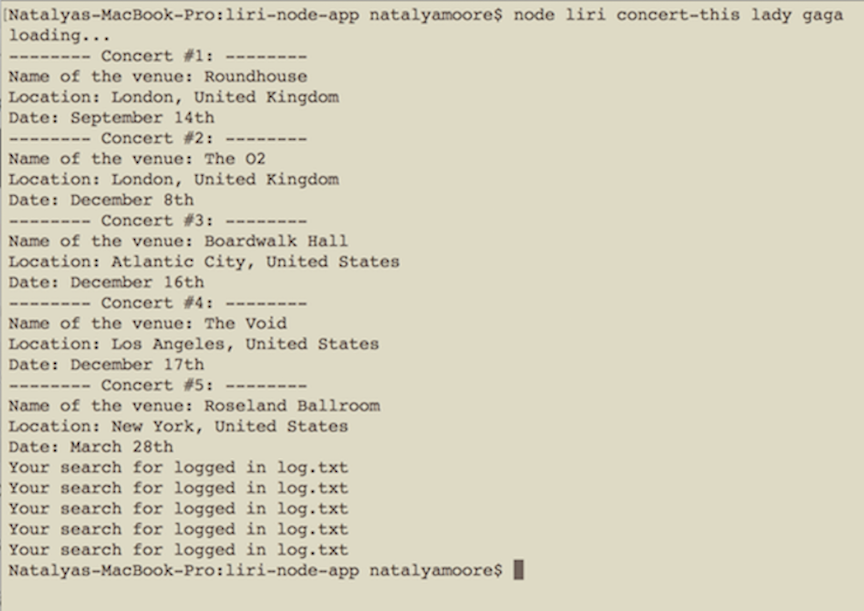

# liri-node-app
Hi there! 
Check out this new node app that I made. It listens to your commands and performs a search for a movie, song or concerts of a specific artist. All you have to do is ask LIRI what you'd like her to do out of the following 4 actions:

1. Item 1 **node liri concert-this name**
1. Item 2 **node liri spotify-this-song name**
1. Item 3 **node liri movie-this name**
1. Item 4 **node liri do-what-it-says**

I also have a couple added features:
If your request has an empty or incorrect action - it will give you an error and explain how to work it correctly.
If you skip the name in the search - it will give you a predefined search result.

I also have a random action feature **do-what-it-says** which will randomly pick an item to search from a list of options that I picked in advance.

And last, but not least - my app logges all your search data into the **log.txt** file - so you can take it with you!
